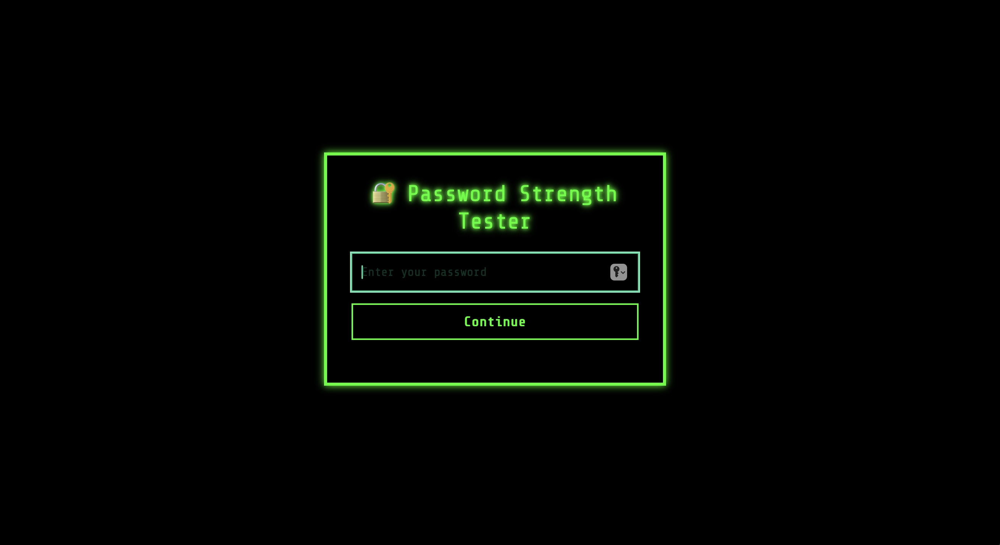
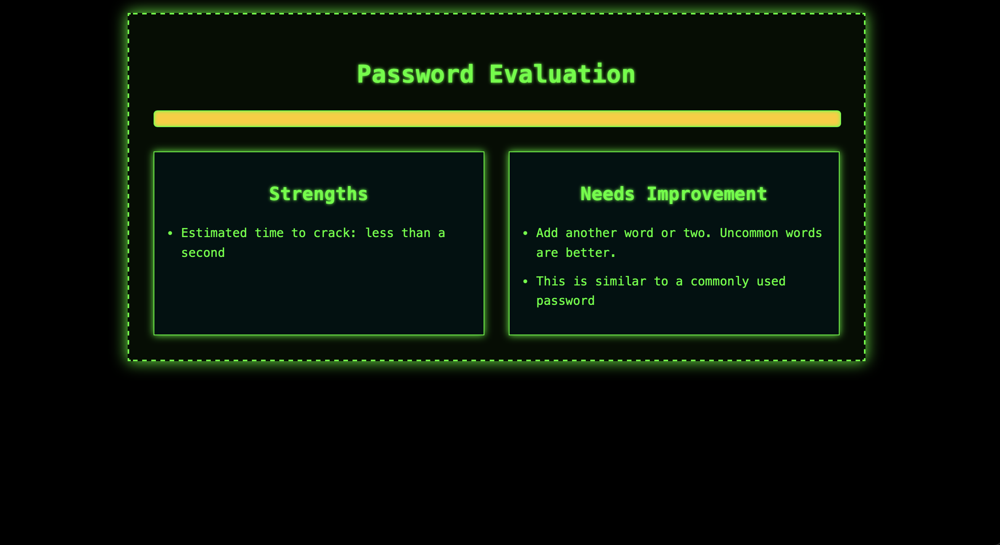
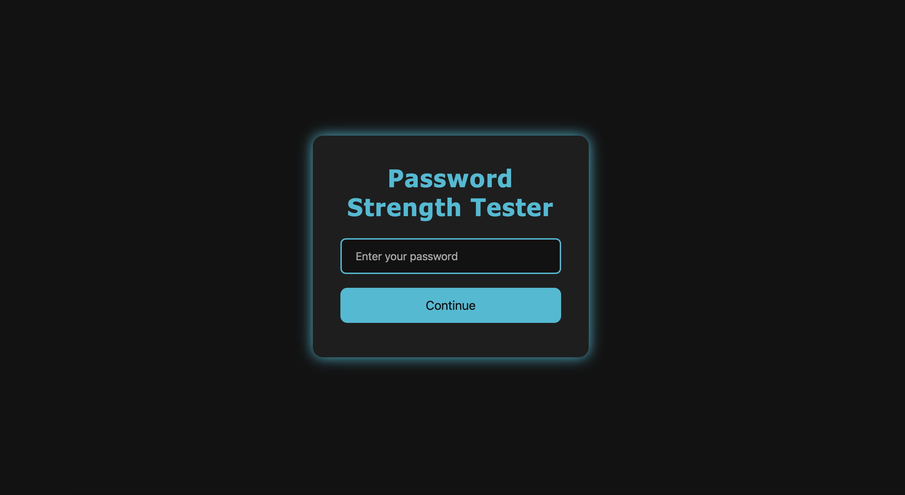
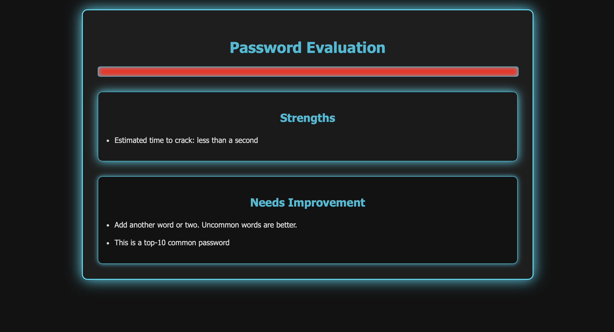

# KeySentinel — Password Strength Tester (Mini Project)

A simple and clean password strength tester built in my free time.  
It analyzes password strength using **zxcvbn**, shows estimated time to crack, and gives useful feedback.  
Everything runs **fully client-side** — no password is stored or uploaded.

This repository includes two UI versions:
- **Version 1** — initial design (1.png / 2.png)
- **Version 2** — improved layout & better feedback display (3.png / 4.png)

---

## 📸 Screenshots

### ✅ Version 1
#### Input View


#### Output View


---

### ✅ Version 2
#### Input View


#### Output View


---

## 🚀 Features
- Built using **HTML**, **CSS**, & **JavaScript**
- Uses **zxcvbn** for:
  - Strength score (0–4)
  - Estimated crack-time display
  - Feedback on password weaknesses
- Simple UI to demonstrate password security basics
- No backend — works offline

---

---

## ▶️ How to Run
Just open a file in any browser ✅

Example:
```bash
open index.html   
  

